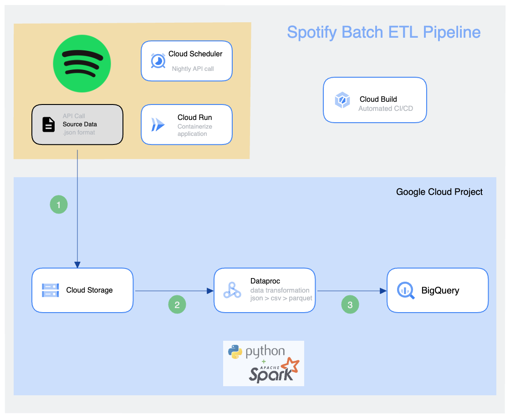

# Spotify Batch ETL Pipeline on GCP

This project is a batch ETL pipeline designed to ingest a single user's playback history, automated to run on a daily basis. The Spotify API allows the developer to extract up to 50 songs played per day (at the time of writing this). The end-to-end process involves extracting the data from source, performing some transformation steps and finally uploading the results to GCP Bigquery, following best practices and automation of the CI/CD process.

## Architecture



## Setup Pyspark for local development

In order to access files directly from GCS, download the Cloud Storage Connector for Hadoop from the Google documentation https://cloud.google.com/dataproc/docs/concepts/connectors/cloud-storage
Place the .jar file in your local venv pyspark directory. In this case: `venv/lib/python3.11/site-packages/pyspark/jars/gcs-connector-hadoop3-latest.jar`

In order to write data directly to BigQuery, download the BigQuery Connector from GitHub: https://github.com/GoogleCloudDataproc/spark-bigquery-connector,
and place the .jar file in your local venv pyspark directory. In this case: `venv/lib/python3.11/site-packages/pyspark/jars/spark-3.3-bigquery-0.32.2.jar`

## Build Image
```
gcloud builds submit --config cloudbuild.yaml
```

## Further Development/Improvements
This project is by no means 'complete', as there are still many improvements which can be implemented:

- configure streaming of playback history in real-time, rather than batch loads
- code cleanup & refactoring: separate pyspark pipeline steps into separate, modular packages for code reusability across different pipelines
- configure separate test and production environments within Github Actions
- Nice to have: Visualization/dashboard for analysis frequently played songs, genres, artists
